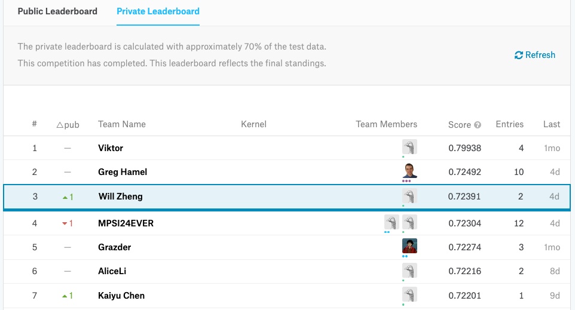
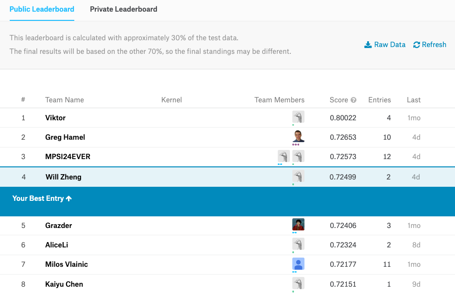
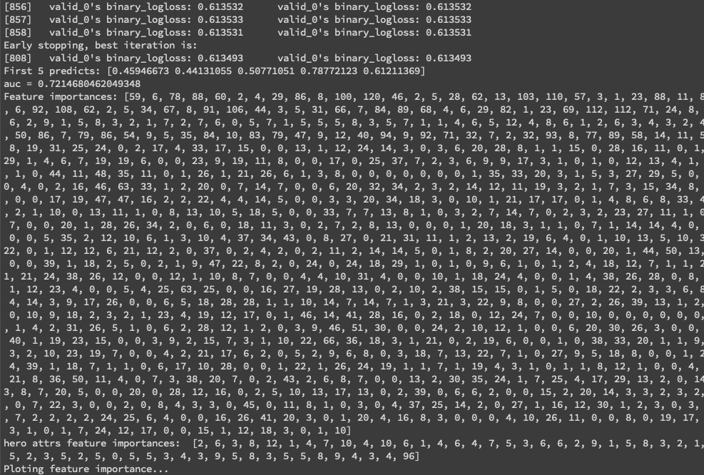
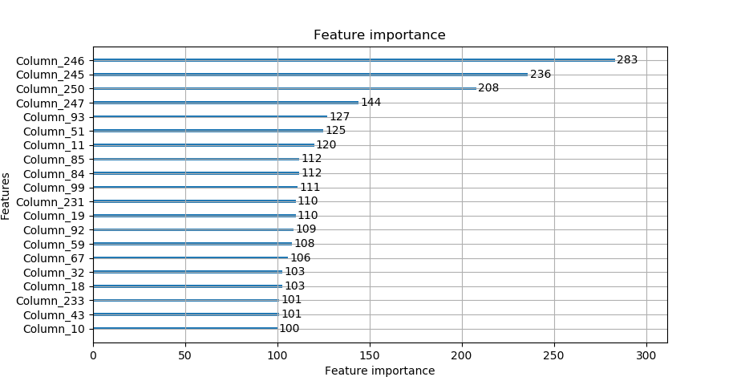

# 实验报告

## 小组分工

**Alice**

## Kaggle比赛说明 成绩截图

在比赛最终70%的数据集的排行榜上，我们最好的模型排名第三。



在比赛过程中30%的数据集的排行榜上，我们最好的模型排名第四。



## 代码和目录结构，运行文档

代码分为三个部分，均放置在 code 文件夹内。

+ work.py 入口程序，配置了运行选项

+ dataloader.py 包含数据读取和特征提取的代码

+ hero_feats.py 包含对英雄特征的提取代码

在 code 文件夹下运行 `pip install -r requirements` 安装依赖包；
运行 `python work.py` 加参数运行代码。

```shell
# 运行 First Version 的基线程序
python work.py -b

# 运行 Second Version 的程序
python work.py -s

# 运行 Third Version 和 Forth Version 的程序（N 为集成模型的数量，不写默认为1）
python work.py -a (N)
```

## 问题描述 数据描述 数据可视化

**cky**

## 算法

### 草稿

#### First Version -- 0.614

我们将所有的columns作为features，作为一个二分类任务送给XGBoost进行分类。

#### Second Version -- 0.721

(+4%) 我们将输出的submission的二分类0/1输出，变为概率输出。

(+6%) 为了让英雄的使用情况体现在Feature中，我们将双方的10个英雄展开到 10 * 112 (英雄个数) * 7 (英雄feature) 维度上。

(+1%) 我们把交换双方后的数据也加入训练集中，使得训练数据翻倍。

#### Third Version -- 0.723

(+0.2%) 对比赛中的每个角色使用的英雄添加onehot的roles特征

#### Forth Version -- 0.725

(+0.2%) 使用3-9个相同的第三版的模型进行集成学习，结果逐渐接近0.725。


### 决策树 XGBoost LightGBM

**Alice**

### 特征提取

**Alice**

### 模型集成

我们使用3-9个第三版的模型进行集成学习，在公开数据集上使结果逐渐接近0.725。我们编写了可以控制集成模型的个数的启动参数，可以方便地进行多次实验。

### tricks

**cky**

## 运行结果和可视化(决策树可视化)

**cky**


第三版的模型运行结果如下图:



特征重要性可视化如下图:



